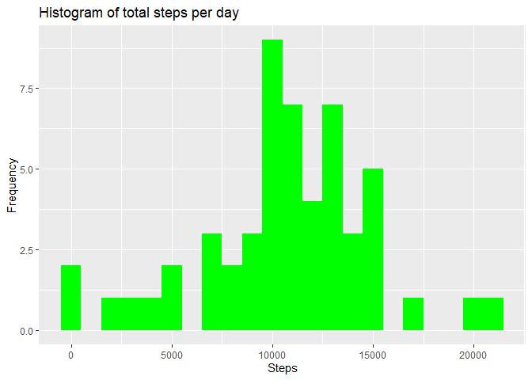
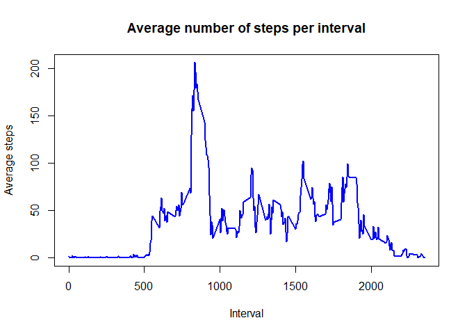
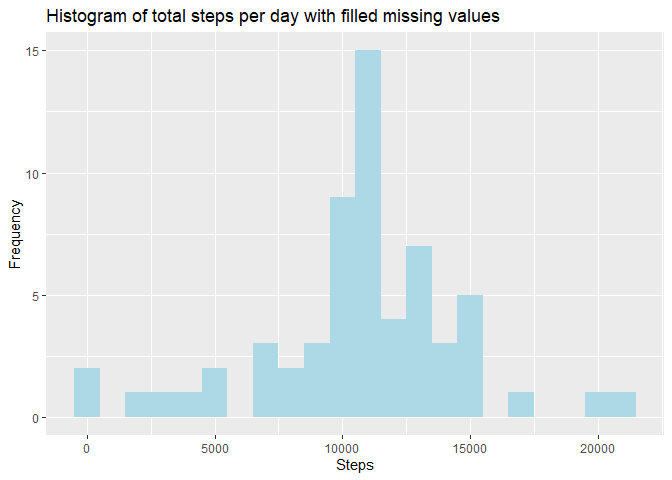

## Loading and preprocessing the data
Download file from the web and unzip it.

```r
fileUrl <- "https://d396qusza40orc.cloudfront.net/repdata%2Fdata%2Factivity.zip"
if(!file.exists("data")) {
  dir.create("data")
  download.file(fileUrl, "./data/activity.zip")
  unzip("data/activity.zip", exdir = "data")
}
```
Read file and save it in activity variable.

```r
activity <- read.csv("data/activity.csv")
```
Show information about in data set using str function.

```r
str(activity)
```

```
## 'data.frame':	17568 obs. of  3 variables:
##  $ steps   : int  NA NA NA NA NA NA NA NA NA NA ...
##  $ date    : chr  "2012-10-01" "2012-10-01" "2012-10-01" "2012-10-01" ...
##  $ interval: int  0 5 10 15 20 25 30 35 40 45 ...
```
Transform date to date type.

```r
activity <- transform(activity, date = as.Date(date))
str(activity)
```

```
## 'data.frame':	17568 obs. of  3 variables:
##  $ steps   : int  NA NA NA NA NA NA NA NA NA NA ...
##  $ date    : Date, format: "2012-10-01" "2012-10-01" ...
##  $ interval: int  0 5 10 15 20 25 30 35 40 45 ...
```

## What is mean total number of steps taken per day?
Calculate the total number of steps per day.

```r
totalStepsPerDay <- sapply(split(activity$steps, activity$date), sum)
```
Sapply function returns a vector, so for plots we should convert it to data frame.

```r
totalStepsPerDay <- as.data.frame(totalStepsPerDay)
```
Make a histogram of the total number of steps taken each day.
1. Load package ggplot2.

```r
library(ggplot2)
```
2. Create the histogram.

```r
p <- ggplot(data = totalStepsPerDay, aes(x = totalStepsPerDay)) + geom_histogram(fill = "green", binwidth = 1000) + labs(x = "Steps", y = "Frequency", title = "Histogram of total steps per day")
p
```

```
## Warning: Removed 8 rows containing non-finite values (stat_bin).
```

<!-- -->

Calculate the mean of the total number of steps taken per day.

```r
mean(totalStepsPerDay$totalStepsPerDay, na.rm = TRUE)
```

```
## [1] 10766.19
```
Calculate the median of the total number of steps taken per day.

```r
median(totalStepsPerDay$totalStepsPerDay, na.rm = TRUE)
```

```
## [1] 10765
```
## What is the average daily activity pattern?
Calculate the mean number of steps per interval.

```r
meanStepsPerInterval <- sapply(split(activity$steps, activity$interval), mean, na.rm = TRUE)
```
Sapply function returns a vector, so for plots we should convert it to data frame.

```r
meanStepsPerInterval <- as.data.frame(meanStepsPerInterval)
```
Create Time series plot of the average number of steps taken.

```r
plot(row.names(meanStepsPerInterval), meanStepsPerInterval$meanStepsPerInterval, type = "l", col = "blue", lwd = 2, main = "Average number of steps per interval", xlab = "Interval", ylab = "Average steps")
```

<!-- -->

Calculate which interval contains the maximum number of steps.

```r
meanStepsPerInterval[which.max(meanStepsPerInterval$meanStepsPerInterval), ]
```

```
## [1] 206.1698
```
As we can see, this value are in interval: 835.

```r
meanStepsPerInterval["835",]
```

```
## [1] 206.1698
```

## Imputing missing values
Calculate and report the total number of missing values in the dataset. 

```r
numberOfMissingValues <- sum(is.na(activity$steps))
numberOfMissingValues
```

```
## [1] 2304
```

The strategy for filling in all of the missing values in the dataset is to use the mean for that 5-minute interval.

Create a new dataset that is equal to the original dataset but with the missing data filled in.

```r
activityWithFilledMV <- activity
for(i in 1:nrow(activity)) {
  if(is.na(activity$steps[i])) {
	  interval <- as.character(activity$interval[i])
	  activityWithFilledMV$steps[i] <- meanStepsPerInterval[interval,]
  }
}
```

Make a histogram of the total number of steps taken each day.

1.Calculate the total number of steps per day.

```r
totalStepsPerDayWithFilledMV <- sapply(split(activityWithFilledMV$steps, activityWithFilledMV$date), sum)
```
2. Convert data to data frame.

```r
totalStepsPerDayWithFilledMV <- as.data.frame(totalStepsPerDayWithFilledMV)
```
3. Create the histogram.

```r
p <- ggplot(data = totalStepsPerDayWithFilledMV, aes(totalStepsPerDayWithFilledMV)) + geom_histogram(fill = "lightblue", binwidth = 1000) + labs(x = "Steps", y = "Frequency", title = "Histogram of total steps per day with filled missing values")
p
```

<!-- -->

Calculate the mean of total number of steps taken per day.

```r
mean(totalStepsPerDayWithFilledMV$totalStepsPerDayWithFilledMV)
```

```
## [1] 10766.19
```
Calculate the median of total number of steps taken per day.

```r
median(totalStepsPerDayWithFilledMV$totalStepsPerDayWithFilledMV)
```

```
## [1] 10766.19
```
The difference between total number of steps without missing values is that valuea of mean and median are the same unlike the dataset with NAs.

## Are there differences in activity patterns between weekdays and weekends?
Create a new factor variable in the dataset with two levels – “weekday” and “weekend” indicating whether a given date is a weekday or weekend day.

```r
days <- character()
for(i in 1:nrow(activityWithFilledMV)) {
	if(weekdays(activityWithFilledMV$date[i]) == "воскресенье" | weekdays(activityWithFilledMV$date[i]) == "суббота") {
		days[i] <- "weekend"
	}
	else{
		days[i] <- "weekday"
	}
}
```
Load package dplyr for adding column weekdays to the dataset.

```r
library(dplyr)
```

```r
activityWithFilledMV <- mutate(activityWithFilledMV, weekdays = days)

activityWithFilledMV <- transform(activityWithFilledMV, weekdays = as.factor(weekdays))
```

Make a panel plot of the 5-minute interval and the average number of steps taken, averaged across all weekday days or weekend days.
1. Load package lattice.

```r
library(lattice)
```
2. Create the plot.

```r
stepsPerWeekdays <- aggregate(steps ~ interval+weekdays, data = activityWithFilledMV, mean)
xyplot(steps ~ interval | weekdays, data = stepsPerWeekdays, layout = c(1, 2), type = "l")
```

<!-- -->
